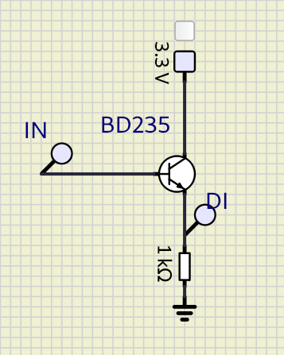
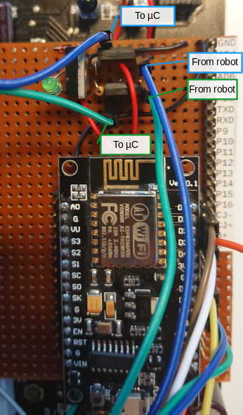

Hardware Setup
==============

components
----------

 - Robot System Robby RP5 ROBOT (CCRP5)
 - NodeMCU version 3

### robot base CCRP5

The robot base is the "Robot System Robby RP5 ROBOT (CCRP5)" by Conrad Electronic GmbH. It is a mobile robot with chain drive. Its main processor is a C-Control/BASIC microcomputer. It was originally distributed under the order code `19 03 33`, EAN: `4016138222968`.

Resources:

 - [product website](https://www.conrad.de/de/p/roboter-robby-rp5-190333.html) with firmware, manuals, schematics and more for download
 - [Wiki article at RN-Wissen.de](https://rn-wissen.de/wiki/index.php/CCRP5) with detailed description of the circuits

As copyright or other restrictions may apply to the resources, I will not distribute them. I can only hope they will remain available.

### NodeMCU

NodeMCU is a simple board. Its main component is a ESP8266 system on a chip. It contains a Wi-Fi microchip with microcontroller capability. This simplifies to develop programs which can easily connect to the internet.

It can easily be programmed with the Arduino IDE. Board support packages for NodeMCU are available.

system design
-------------

The CCRP5 has two microcontrollers:

 - subsystem IC2 `MC68HC705KJ1`
 - main controller IC7 `MC68HC05B6`

The CCRP5 is designed such as, the subsystem is only programmed by the manufacturer. There is no in-system programming interface. All applications shall be written for the main controller.

The main controller should be programmed with a proprietary development environment CCEW32D. Programs must be written in CCBASIC, which is a dialect of the BASIC programming language. The applications are based on a firmware `P5DRIV.S19`. CCBASIC is a low level language. The documentation is available to a limited extent.

This projects aims to control the hardware of the CCRP5 without the CCRP5 microcontrollers. Thus signals from the CCRP5 are tapped and wired to the NodeMCU board.

connections
-----------

 - input circuit for odometry sensors: 
 - help to connect odometry sensors: 

| NodeMCU pin | signal on base board    | signal at CCRP5 |
| ----------- | ----------------------- | --------------- |
| D6          | *blue*: emitter BD235/1 | PB2@I2          |
| D7          | *green*: emitter BD235/2| PB3@I2          |
| D5          | *yellow*                | PORT 5          |
| D3          | *white*                 | PORT 6          |
| D1          | *brown*                 | D/A 1           |
| D2          | *orange*                | D/A 2           |

| Label | GPIO   | Input        | Output                | Notes                                                           |
|-------|--------|--------------|-----------------------|-----------------------------------------------------------------|
| D0    | GPIO16 | no interrupt | no PWM or I2C support | HIGH at bootused to wake up from deep sleep                     |
| D1    | GPIO5  | OK           | OK                    | often used as SCL (I2C)                                         |
| D2    | GPIO4  | OK           | OK                    | often used as SDA (I2C)                                         |
| D3    | GPIO0  | pulled up    | OK                    | connected to FLASH button, boot fails if pulled LOW             |
| D4    | GPIO2  | pulled up    | OK                    | HIGH at bootconnected to on-board LED, boot fails if pulled LOW |
| D5    | GPIO14 | OK           | OK                    | SPI (SCLK)                                                      |
| D6    | GPIO12 | OK           | OK                    | SPI (MISO)                                                      |
| D7    | GPIO13 | OK           | OK                    | SPI (MOSI)                                                      |
| D8    | GPIO15 | pulled to GND| OK                    | SPI (CS); Boot fails if pulled HIGH                             |
| RX    | GPIO3  | OK           | RX pin                | HIGH at boot                                                    |
| TX    | GPIO1  | TX pin       | OK                    | HIGH at boot; debug output at boot, boot fails if pulled LOW    |
| A0    | ADC0   | Analog Input | X                     |                                                                 |

Table above is adapted from [this reference](https://randomnerdtutorials.com/esp8266-pinout-reference-gpios/#table).

The signals `D/A 1` and `D/A 2` have been disconnected from the pins of the CCRP5's main microcontroller (IC7) because the pins are configured as drain. This interferes with the control of the NodeMCU and causes an 80mA current. The signals have been disconnected by un-soldering and lifting of the microcontroller's pins.

Software
========

The source code is written in C++. It is compiled and programmed with the [Arduino IDE](https://www.arduino.cc/en/Main/Software). The [board support package for the ESP8266 chip](https://github.com/esp8266/Arduino) must be installed.