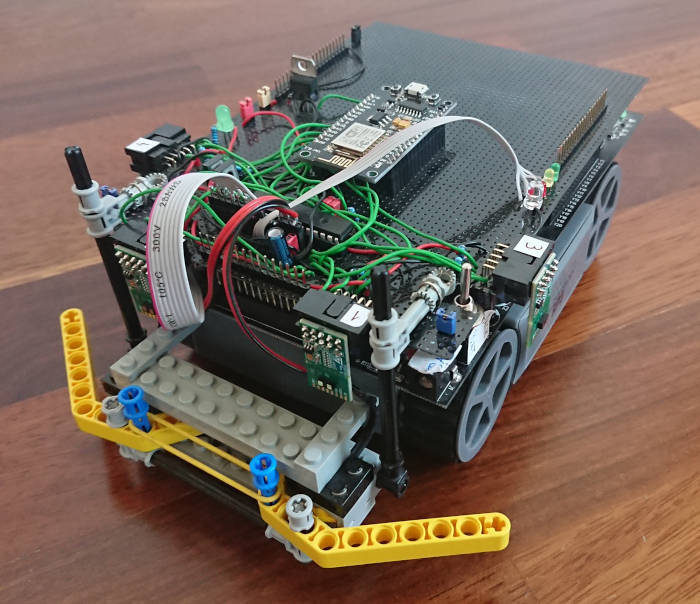
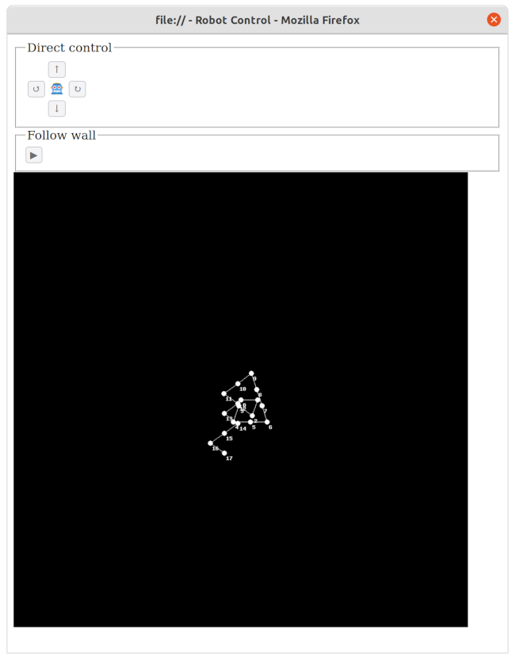
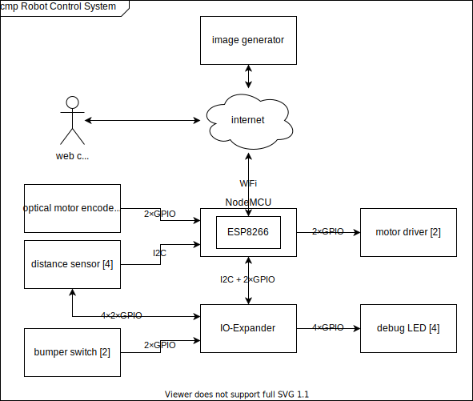

This page describes the system developed.

Functions
=========

The robot system can be controlled by an operator through a web client.

There are two modes of operation.
One is a manual mode called "direct control".
The other is an automatic mode called "follow wall".

The commands are sent via a HTML form to the webserver hosted by the robot.
While a command is executed the controls are disabled.
The interaction between web client and webserver is achieved through responding to the form submission and periodic refreshes of the website.

direct control
--------------

These commands are available:

 - drive forward by 37,7mm
 - drive backward by 37,7mm
 - turn left by 86,4°
 - turn right by 86,4°

The numbers are crooked as they are a multiple of the distance of the way which can be measured with the motor encoder.

In direct control mode the trajectory which has been commanded to drive is recorded and displayed as a map.
The rendering of the map is not performed by the robot itself.
Instead the map data is send as part of the HTML page.
The page in turn queries another server capable of PHP to render the map using the provided data.
For this a small script is deployed on a server which uses the [GD library](https://www.php.net/manual/en/book.image.php).

If the robot's bumper are pushed (usually because the robot hits an obstacle) the robot stops immediately.
Only the drive backward command is effective in this case.

follow wall
-----------

In follow wall mode the robot follows a wall.
For this the distance sensors are used.

The algorithm first instructs the robot to turn around while sweeping its surrounding with the laser-ranging distance sensors.
Then it turns towards/outbound the closest distance, adjusts its distance to a fixed value and aligns itself to the wall.

It then repeatedly drives for a small distance while it measures the distance to the wall at the beginning and the end of this distance.
With this information it calculates the angle which it needs to turn in order to adjust its distance to the wall to the desired value within a certain distance.

> What is the direction to drive to in order to be at distance x after driving for y?

Then it turns to that direction and repeats the procedure.

In general the algorithm assumes that the wall is straight.
It tries to achieve the target distance to the wall.
Independent of whether the error is because the robot missed the target or because the wall actually was not straight.

The following sketch has been created with GeoGebra:

The sketch above shows how target vector the the distance to the wall "t" is calculated.

 1. The robot starts a position P1 and measures the distance to the wall "c".
 2. The robot drives for a defined distance "d" to the next point P2.
 3. The distance to the wall "f" is measured. f=c+b
 4. Using trigonometric functions the target vector is calculated.

Hardware Setup
==============

components
----------

The main components of the system are:

 - Robot System Robby RP5 ROBOT (CCRP5) which contains (among other things):
    - chain drive with 2 motors
    - optical motor encoder made of simple light barriers
 - NodeMCU version 3
 - 4× distance sensor: Time-of-Flight (ToF), laser-ranging, miniature sensor by STMicroelectronics [VL53L1](https://www.st.com/en/imaging-and-photonics-solutions/vl53l1.html)
 - a bumper made of LEGO Mindstorms (first generation) parts with 2 micro-switches

### robot base CCRP5

The robot base is the "Robot System Robby RP5 ROBOT (CCRP5)" by Conrad Electronic GmbH. It is a mobile robot with chain drive. Its main processor is a C-Control/BASIC microcomputer. It was originally distributed under the order code `19 03 33`, EAN: `4016138222968`.

Resources:

 - [product website](https://www.conrad.de/de/p/roboter-robby-rp5-190333.html) with firmware, manuals, schematics and more for download
 - [Wiki article at RN-Wissen.de](https://rn-wissen.de/wiki/index.php/CCRP5) with detailed description of the circuits

As copyright or other restrictions may apply to the resources, I will not distribute them. I can only hope they will remain available.

### NodeMCU

NodeMCU is a simple board. Its main component is a ESP8266 system on a chip. It contains a Wi-Fi microchip with microcontroller capability. This simplifies to develop programs which can easily connect to the internet.

It can easily be programmed with the Arduino IDE. Board support packages for NodeMCU are available.

system design
-------------

The CCRP5 has two microcontrollers:

 - subsystem IC2 `MC68HC705KJ1`
 - main controller IC7 `MC68HC05B6`

The CCRP5 is designed such as, the subsystem is only programmed by the manufacturer. There is no in-system programming interface. All applications shall be written for the main controller.

The main controller should be programmed with a proprietary development environment CCEW32D. Programs must be written in CCBASIC, which is a dialect of the BASIC programming language. The applications are based on a firmware `P5DRIV.S19`. CCBASIC is a low level language. The documentation is available to a limited extent.

This projects aims to control the hardware of the CCRP5 without the CCRP5 microcontrollers.
Thus an additional "piggyback" PCBA is installed onto the basis CCRP5 PCBA which is tapping into the signals from the CCRP5.
The piggyback PCBA includes the NodeMCU board.

connections
-----------

### Piggyback PCBA

The schematics of the piggyback PCBA are described in `hardware/robot-control-circuit/robot-control-circuit.sch`.

### Basis PCBA

The original schematics can be retrieved at the above mentioned resources.

Some modifications were made to the CCRP5's PCBA.
The signals `D/A 1` and `D/A 2` have been disconnected from the pins of the CCRP5's main microcontroller (IC7) because the pins are configured as drain (referencing to CCRP5's schematics).
This interferes with the control of the NodeMCU and causes an 80mA current.
The signals have been disconnected by un-soldering and lifting of the microcontroller's pins.

Also the IO-expander `I11` has been disconnected in order to be able to control the current for the IR-LEDs `D3` and `D4`.

Software
========

The source code is written in C++.
It is compiled and programmed with the [Arduino IDE][].

Dependencies:

 - [Arduino IDE][]. Tested with v2.0.0-beta.4 should work with 1.5.x+.
 - The [board support package for the ESP8266 chip](https://github.com/esp8266/Arduino) must be installed.
   Tested using version 2.7.4.
   Version 3.0.0, (3.0.1 not tested) and 3.0.2 do not work because of [this bug](https://github.com/espressif/esp-idf/issues/4542).
 - The [Arduino library VL53L1 by STM32duino](https://github.com/stm32duino/VL53L1) must be installed. Tested using version 2.0.1.
 - The [SimplyAtomic library](https://github.com/wizard97/SimplyAtomic) must be installed. Tested in version 1.0.
 - The [MPC23017 library by Bertrand Lemasle](https://github.com/blemasle/arduino-mcp23017) must be installed. Tested in version 2.0.0.

[Arduino IDE]: https://www.arduino.cc/en/Main/Software

Developing without Arduino IDE
------------------------------

In case one wants to use an IDE other than Arduino to write the code some provisions should be met:

 - Add the following include paths
   (where `${ARDUINO_LIB_PATH}` is the path to the Arduino libraries (for example `~/Arduino/libraries`),
          `${AVR_PATH}` is the path to the AVR header files (for example `~/.arduino15/packages/arduino/tools/avr-gcc/7.3.0-atmel3.6.1-arduino7/avr/include`),
          `${ESP8266_HARDWARE_PATH}` is the path to the hardware part of the ESP8266 board support package (for example `~/.arduino15/packages/esp8266/hardware/esp8266/2.7.4`),
          `${ESP8266_COMPILER_PATH}` is the path to the software part of the ESP8266 board support package (for example `~/.arduino15/packages/esp8266/tools/xtensa-lx106-elf-gcc/2.5.0-4-b40a506`)):
   - `${AVR_PATH}`
   - `${ARDUINO_LIB_PATH}/MCP23017/src`
   - `${ARDUINO_LIB_PATH}/SimplyAtomic`
   - `${ARDUINO_LIB_PATH}/STM32duino_VL53L1/src`
   - `${ESP8266_HARDWARE_PATH}/cores/esp8266`
   - `${ESP8266_HARDWARE_PATH}/tools/sdk/include`
   - `${ESP8266_HARDWARE_PATH}/tools/sdk/lwip2/include`
   - `${ESP8266_HARDWARE_PATH}/variants/nodemcu`
   - `${ESP8266_HARDWARE_PATH}/libraries/Wire`
   - `${ESP8266_HARDWARE_PATH}/libraries/ESP8266WiFi/src`
   - `${ESP8266_HARDWARE_PATH}/libraries/ESP8266WebServer/src`
   - `${ESP8266_COMPILER_PATH}/lib/gcc/xtensa-lx106-elf/4.8.2/include`
   - `${ESP8266_COMPILER_PATH}/xtensa-lx106-elf/include`
   - `${ESP8266_COMPILER_PATH}/xtensa-lx106-elf/include/c++/4.8.2`
 - Add the following preprocessor macros:
   - `ARDUINO_ARCH_ESP8266`

For compiling and flashing the Arduino IDE is recommended.

Configuration
-------------

In order to reduce dynamic memory usage, one may reduce the maximum number of range data produced by the VL53L1 library.
In order to achive that, add the following line to the [`platform.local.txt`](https://arduino.github.io/arduino-cli/0.20/platform-specification/#platformlocaltxt) file.
That file must be in `${ESP8266_HARDWARE_PATH}`.
Create it if not existent.

    compiler.cpp.extra_flags=-DVL53L1_MAX_RANGE_RESULTS=1

This defines a predefined macro which sets the number of maximum range data to 1.
